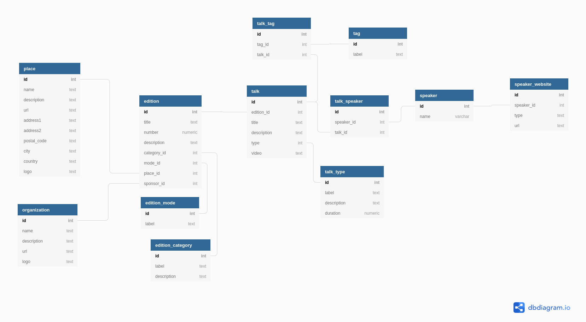

# 3. Design initial de l'api

Date: 2020-11-24

- Décideurs: [Alexis Janvier](https://github.com/orgs/CaenCamp/people/alexisjanvier)
- Ticket.s concerné.s: -
- Pull.s Request.s: -

## Statut

2020-11-24 accepted

## Contexte et énoncé du problème

La toute première étape de la migration des contenus depuis l'ancien site en [Gatsby](https://www.gatsbyjs.com/) vers la nouvelle API consiste à trouver une design d'API qui soit sémantiquement valide et globalement reconnu (par exemple en se basant sur schema.org), et de faire correspondre les données portées dans les fichiers markdown du contenu initial avec ce design d'API.

### Rappel du fonctionnement actuel

Chaque objet markdown s'appuie sur un [`front matter`](https://odetocode.com/blogs/scott/archive/2020/01/30/markdown-front-matter-for-metadata.aspx) en `yaml` pour gérer les propriétés.

Les objets principaux sont les `Talks`, identifiés par le numero de l'édition. Le ou les `Speakers` sont rattachés à un talk via leur `slug`.

Dans le cas ou une édition aurait un ou des `Lightnings` talks, on l'associe à une édition via ... le numéro d'édition.

Un talk est associé à une `Place`, mais en vrai les lieux ne sont pas gérés.

Les `Devops` CaenCamp sont presque identiques aux `Talks`, sauf que le front matter porte les talks.

Les sessions de `Codings` CaenCamp sont aussi très proche des `Talks`, à la différence qu'elles ne sont pas associées à un ou des `Speakers`.

## Options envisagées

- **[Option 1]** - Faire un design correspondant aux données existante, puis le faire évoluer vers les descriptions schema.org existantes
- **[Option 2]** - Faire notre propre description sémantique de contenu (RDFS, OWL) et ne pas utiliser schema.org afin de limiter le mapping avec les données existantes
- **[Option 3]** - Établir le design d'API en se basant sur schema.org, établir un modèle d'objets correspondant à l'existant, et faire un mapping intermédiaire entre nos objets et le schema d'API.

## Résultat de la décision

Option choisie : **"[option 3] - Établir le design d'API en se basant sur schema.org, établir un modèle d'objets correspondant à l'existant, et faire un mapping intermédiaire entre nos objets et le schema d'API"**, parce que c'est celui qui nous permet de ne pas avoir à faire de concessions ni sur notre modèle métier, ni sur notre objectif de standardisation de la donnée.

### Conséquences positives

- Nous gardons un modèle que nous connaissons bien.
- La donnée existante sera plus facile à importer.
- Nous pouvons générer rapidement le contrat d'API en se basant sur les descriptions de schema.org.
- Cette option ne ferme pas complètement les deux autres options : nous pourrons faire évoluer notre modèle, éventuellement pour être plus proche du modèle exposé par l'API. Mais nous pourrons aussi faire évolué le modèle de l'API sans avoir à intervenir sur notre modèle de base de données.

### Conséquences négatives

- Une mise en place initial un peu plus longue, puisque il faudra dans un premier temps faire de manière disjointe la mise en place de l'API et du modèle persisté en base, puis d'établir le mapping entre les deux.

## Avantages et inconvénients des options

### [option 1] Faire un design correspondant aux données existante, puis le faire évoluer vers les descriptions schema.org existantes



Ce modèle sql traduit au mieux les données existantes en `markdown`, mais aussi assez bien le fonctionnement des CaenCamp. Pour autant, nous somme assez loin du modèle imposé par schema.org. Typiquement, pour une édition d'un CaenCamp, on peut avoir un ou plusieurs talks de type différent (talk long ou lightning talk). Pour schema.org nous devrions avoir un `event` principal (une édition) avec plusieurs `subEvents` (des talks). Du point de vue modèle, cette organisation est moins simple à mettre en place et représente moins nos objets réel ...

### [option 2] Faire notre propre description sémantique de contenu

Du coup, plutôt que d'adapter nos objets *métier* à ceux de schema.org, on peut réfléchir à mettre en place notre propre description de ce que l'on fait dans un format standard (RDFS, OWS). J'aime bien cette approche, mais :

1. Je ne maitrise pas assez bien ces standards
2. Nous produirions des données certes expliquée mais non standardisées, dans le sens reconnues par le plus grand nombre. Ce que fait schema.org

Donc approche intéressante, mails il faudrait que nous ayons au moins à discuter d'une telle description avec une autre organisation (par exemple un autre organisateur de meetup).

### [option 3] Établir le design d'API en se basant sur schema.org, établir un modèle d'objets correspondant à l'existant, et faire un mapping intermédiaire entre nos objets et le schema d'API

Cette option consiste donc à garder notre modèle métier, mais à l'exposer via l'API dans un format standardisé.

Par exemple, nous devrions transformer une édition et ses talks associés en un `event` comportant autant de `subEvent` que l'édition contient de talks. Un `speaker` deviendrait un `performer` ...

## Annexes

### Les objets schema.org

#### Events

| Props               | Type                                                        |
| ------------------- | ----------------------------------------------------------- |
| startDate           | DateTime                                                    |
| endDate             | DateTime                                                    |
| duration            | Duration                                                    |
| eventAttendanceMode | EventAttendanceModeEnumeration                              |
| location            | Place or VirtualLocation                                    |
| organizer           | Organization                                                |
| performer           | Person, Supersedes performers.                              |
| recordedIn          | CreativeWork                                                |
| sponsor             | Organization                                                |
| subEvent            | Event, Supersedes subEvents -  Inverse property: superEvent |
| superEvent          | Event                                                       |
| --                  | --                                                          |
| additionalType      | Url                                                         |
| description         | Text                                                        |
| identifier          | Text or Url                                                 |
| image               | ImageObject or Url                                          |
| name                | text                                                        |

#### Place

| Props       | Type               |
| ----------- | ------------------ |
| address     | PostalAddress      |
| --          | --                 |
| description | Text               |
| identifier  | Text or Url        |
| image       | ImageObject or Url |
| name        | text               |

#### PostalAddress

| Props           | Type |
| --------------- | ---- |
| addressCountry  | Text |
| addressLocality | Text |
| postalCode      | Text |
| streetAddress   | Text |

#### Person

| Props          | Type               |
| -------------- | ------------------ |
| givenName      | Text (first name)  |
| additionalName | Text               |
| --             | --                 |
| description    | Text               |
| identifier     | Text or Url        |
| image          | ImageObject or Url |
| name           | text               |

#### Organization

| Props       | Type               |
| ----------- | ------------------ |
| memberOf    | Organization       |
| --          | --                 |
| description | Text               |
| identifier  | Text or Url        |
| image       | ImageObject or Url |
| name        | text               |

#### CreativeWork

| Props      | Type        |
| ---------- | ----------- |
| abstract   | Text        |
| --         | --          |
| url        | Url         |
| identifier | Text or Url |


### Les données markdown

#### Talks et Ligntnings

```markdown
--- //front matter en yaml
edition: le numero de l'edition (integer)
meetupId: l'identifiant de l'annonce sur meetup.com
title: Titre du talk
slug: le slug pour générer l'url - gestion manuelle sur le forme edition-xx-titre-du-talk
date: Date et heure au format 2018-11-27 18:30:00
description: "une courte présentation en texte"
tags:
- tag 1
- tag 2
speakers:
- slug-du-speaker
place: slug-du-lieu
video: url youtube
picture: nom du fichier
published: boolean
---

Le contenu de présentation avec un formatage markdown

```

Remarque: on se base sur `edition` pour associer un talk et un lightning talk à une même session.

#### Devops

```markdown
--- //front matter en yaml
edition: le numero de l'edition (integer)
meetupId: l'identifiant de l'annonce sur meetup.com
title: Titre du talk
slug: le slug pour générer l'url - gestion manuelle sur le forme edition-xx-titre-du-talk
date: Date et heure au format 2018-11-27 18:30:00
description: "une courte présentation en texte"
tags:
- tag 1
- tag 2
talks:
- title: titre première pres
    speakers:
    - slug-speaker 
- title: titre seconde pres
    speakers:
    - slug-speaker
place: slug-du-lieu
video: url youtube
picture: nom du fichier
published: boolean
---

Le contenu de présentation avec un formatage markdown

```

#### Speakers

```markdown
--- //front matter en yaml
firstName: prénom
lastName: nom
slug: : le slug pour générer l'url - gestion manuelle sur le forme prenom-nom
resume: une courte présentation en texte
picture: nom de l'image
links:
-   title: titre du lien - utiliser pour l'affichage de l'icône (twitter, github, ...)
    url: url du lien
---

Le contenu de présentation avec un formatage markdown
```

#### Codings

```markdown
--- //front matter en yaml
edition: le numero de l'edition (integer)
meetupId: l'identifiant de l'annonce sur meetup.com
title: Titre du talk
slug: le slug pour générer l'url - gestion manuelle sur le forme edition-xx-titre-du-talk
date: Date et heure au format 2018-11-27 18:30:00
description: "une courte présentation en texte"
place: slug-du-lieu
image: nom du fichier
published: boolean
---

Le contenu de présentation avec un formatage markdown

```